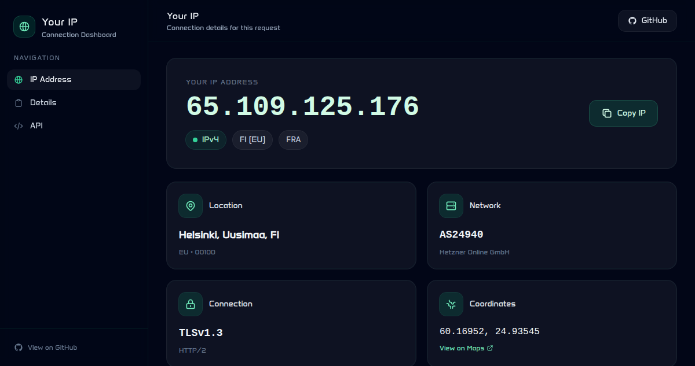

# Your IP - Cloudflare Worker



A fast and cool Cloudflare Worker that displays your IP address, geolocation, and connection infos via well-designed APIs. Perfect for checking your IP, debugging network issues, or integrating IP detection into your scripts.

[](https://deploy.workers.cloudflare.com/?url=https://github.com/jim60105/worker-your-ip)

## ✨ Features

- 🌐 **IP Detection** - Get your IPv4 or IPv6 address instantly
- 📍 **Geolocation** - City, region, country, continent, and coordinates
- 🌍 **Timezone** - Automatic timezone detection
- 🔒 **Connection Info** - TLS version, HTTP protocol, and cipher details
- 🏢 **Network Info** - ASN, organization, and Cloudflare data center
- 📡 **API Endpoints** - Simple plain text and JSON APIs
- 🎨 **Beautiful UI** - Modern, responsive design with dark mode
- ⚡ **Fast** - Edge computing with Cloudflare's global network

## 🚀 Deploy Your Own

> [!TIP]  
> ⭐ **Star the original repository** to stay updated with new features and improvements!  
> By starring [jim60105/worker-your-ip](https://github.com/jim60105/worker-your-ip), you'll receive notifications about updates and can easily find this project later.

Click the button above to deploy your own instance, or follow the manual steps below.

### Manual Deployment

1. Clone this repository:

   ```bash
   git clone https://github.com/jim60105/worker-your-ip.git
   cd worker-your-ip
   ```

2. Install dependencies:

   ```bash
   npm install
   ```

3. Deploy to Cloudflare:

   ```bash
   npm run deploy
   ```

## 📡 API Endpoints

All endpoints return plain text unless otherwise noted.

| Endpoint       | Description                                    | Example Response   |
| -------------- | ---------------------------------------------- | ------------------ |
| `/`            | Beautiful HTML webpage                         | HTML               |
| `/ip`          | Your IP address (IPv4 or IPv6)                 | `203.0.113.1`      |
| `/ipv4`        | Your IPv4 address (400 if unavailable)         | `203.0.113.1`      |
| `/ipv6`        | Your IPv6 address (400 if unavailable)         | `2001:db8::1`      |
| `/json`        | All information as JSON                        | `{"ip": "..."}`    |
| `/country`     | Country code (ISO 3166-1)                      | `US`               |
| `/city`        | City name                                      | `San Francisco`    |
| `/region`      | Region/State name                              | `California`       |
| `/timezone`    | Timezone                                       | `America/Los_Angeles` |
| `/coordinates` | Latitude,Longitude                             | `37.7749,-122.4194`|
| `/continent`   | Continent code                                 | `NA`               |
| `/asn`         | ASN number                                     | `13335`            |
| `/org`         | Organization/ISP name                          | `Cloudflare, Inc.` |
| `/colo`        | Cloudflare data center code                    | `SFO`              |
| `/tls`         | TLS version                                    | `TLSv1.3`          |
| `/protocol`    | HTTP protocol version                          | `HTTP/2`           |
| `/headers`     | Your request headers (JSON)                    | `{"user-agent": "..."}` |

## 💻 Usage Examples

### Get Your IP

```bash
curl https://your-worker.workers.dev/ip
```

### Get IPv4 Only

```bash
curl https://your-worker.workers.dev/ipv4
```

### Get IPv6 Only

```bash
curl https://your-worker.workers.dev/ipv6
```

### Get All Information as JSON

```bash
curl https://your-worker.workers.dev/json
```

### Get Country

```bash
curl https://your-worker.workers.dev/country
```

### Get Timezone

```bash
curl https://your-worker.workers.dev/timezone
```

### Use in Scripts

```bash
# Store IP in a variable
MY_IP=$(curl -s https://your-worker.workers.dev/ip)
echo "My IP is: $MY_IP"

# Check if you have IPv6
if curl -s https://your-worker.workers.dev/ipv6 > /dev/null 2>&1; then
  echo "IPv6 is available"
else
  echo "IPv6 is not available"
fi
```

## 🛠️ Local Development

1. Install dependencies:

   ```bash
   npm install
   ```

2. Start the development server:

   ```bash
   npm run dev
   ```

3. Run tests:

   ```bash
   npm test
   ```

## 📁 Project Structure

```text
worker-your-ip/
├── src/
│   ├── index.ts          # Main worker entry point
│   ├── handlers/
│   │   ├── api.ts        # API endpoint handlers
│   │   └── html.ts       # HTML page generator
│   └── utils/
│       ├── ip.ts         # IP detection utilities
│       └── response.ts   # Response helpers
├── test/
│   ├── api.test.ts       # API endpoint tests
│   ├── ip.test.ts        # IP utility tests
│   └── html.test.ts      # HTML page tests
├── doc/
│   ├── requirement.md    # Project requirements
│   └── plan.md           # Implementation plan
├── wrangler.jsonc        # Wrangler configuration
├── package.json          # Project dependencies
├── tsconfig.json         # TypeScript configuration
├── vitest.config.ts      # Vitest configuration
└── README.md             # This file
```

## 📊 Available Data

This worker leverages Cloudflare's edge network to provide:

### From `request.cf` (IncomingRequestCfProperties)

- `asn` - ASN number
- `asOrganization` - Organization name
- `colo` - Data center IATA code
- `country` - Country code (ISO 3166-1)
- `isEUCountry` - Whether in EU
- `city` - City name
- `continent` - Continent code
- `latitude` - Latitude
- `longitude` - Longitude
- `postalCode` - Postal code
- `region` - Region name
- `regionCode` - Region code (ISO 3166-2)
- `timezone` - Timezone
- `httpProtocol` - HTTP protocol version
- `tlsVersion` - TLS version
- `tlsCipher` - TLS cipher

### From HTTP Headers

- `CF-Connecting-IP` - Client IP address
- `X-Forwarded-For` - Original visitor IP

## 🧪 Testing

Tests are written with Vitest and the Cloudflare Workers testing utilities:

```bash
# Run all tests
npm test

# Run tests in watch mode
npm run test:watch
```

## 📄 License


[GNU GENERAL PUBLIC LICENSE Version 3](LICENSE)

Copyright (C) 2025 Jim Chen <Jim@ChenJ.im>.

This program is free software: you can redistribute it and/or modify it under the terms of the GNU General Public License as published by the Free Software Foundation, either version 3 of the License, or (at your option) any later version.

This program is distributed in the hope that it will be useful, but WITHOUT ANY WARRANTY; without even the implied warranty of MERCHANTABILITY or FITNESS FOR A PARTICULAR PURPOSE. See the GNU General Public License for more details.

You should have received a copy of the GNU General Public License along with this program. If not, see [https://www.gnu.org/licenses/](https://www.gnu.org/licenses/).

---

> [!TIP]  
> Understanding this license:
>
> - You can deploy and use this project as-is, since the webpage includes a link to this GitHub project.
> - If you modify this project, you ***MUST*** make your modified source code available to users under the same license.
> - If you use this project as a dependent API service accessed from another project of yours, you may keep your project's license since we use GPLv3 (not AGPLv3).
